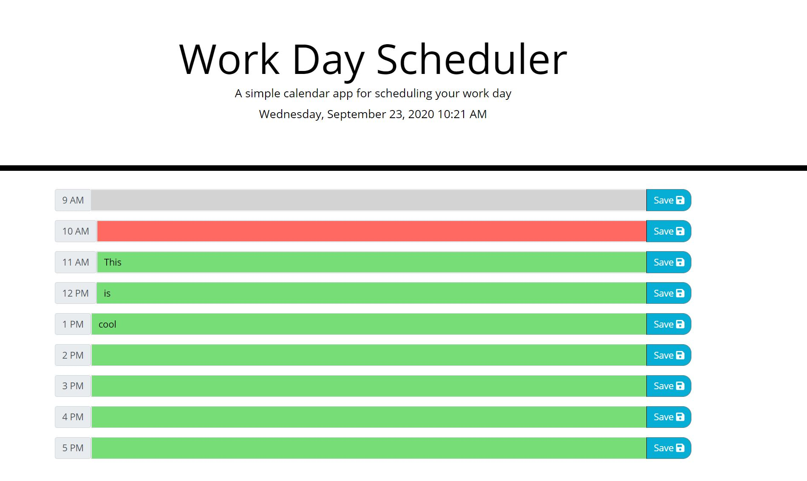

# Day Planner

## Table of Contents
  - [Day Planner](#day-planner)
  - [Table of Contents](#table-of-contents)
  - [Description](#description)
  - [Technology](#technology)
  - [Business Context](#business-context)
  - [Demo](#demo)
  - [Contributors](#contributors)

## Description

Create a simple calendar application that allows the user to save events for each hour of the day. This app will run in the browser and feature dynamically updated HTML and CSS powered by jQuery and/or native JavaScript.

## Business Context

Poor time management can result in missed meetings and deadlines or create the appearance of unprofessionalism. A daily planner allows employees to see their day at a glance, schedule time effectively, and improve productivity.

## Technology 

### [jQuery](https://jquery.com/) : 
* jQuery is a fast, small, and feature-rich JavaScript library. It makes things like HTML document traversal and manipulation, event handling, animation, and Ajax much simpler with an easy-to-use API that works across a multitude of browsers.

### [HTML](https://www.w3schools.com/tags/tag_meta.asp): 
* Hypertext Markup Language (HTML) is the standard markup language for documents designed to be displayed in a web browser. It can be assisted by technologies such as Cascading Style Sheets (CSS) and scripting languages such as JavaScript.

### [Javascript](https://developer.mozilla.org/en-US/docs/Web/JavaScript) : 
* JavaScript is a cross-platform, object-oriented scripting language used to make webpages interactive.
* JavaScript(JS) is a lightweight, interpreted, or just-in-time compiled programming language with first-class functions. 
* With the HTML DOM, JavaScript can access and change all the elements of an HTML document.

### [CSS](https://www.w3schools.com/css/css_intro.asp) : 
*Stands for "Cascading Style Sheet." Cascading style sheets are used to format the layout of Web pages. They can be used to define text styles, table sizes, and other aspects of Web pages that previously could only be defined in a page's HTML.

# Demo
 

## Screenshot  
|

## Contributor
* Brandon Johnson
* Repository: https://github.com/sheikb08/DayPlanner/
* Deployed App: https://sheikb08.github.io/DayPlanner/

